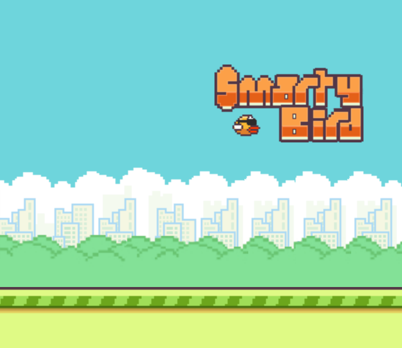

# SMARTY BIRD

This is a reproduction of the game "Flappy Bird" with a genetic deep neural network
AI, made by Luxedo and Faifos. The game is made using [p5.js](https://p5js.org)
and nothing more.

#### Check it online [HERE](https://smarty-bird.firebaseapp.com/)

Besides playing the regular game, you can train a neural network that has 4 inputs
and a bias term. The deep layer has 3 neurons and another bias. The output is a
single neuron. All of the neurons uses `tanh` as the activation function. The bird
*flaps* its wings if the output neuron is activated (if it has a positive value).

The network is trained with a genetic algorithm. The best bird is allowed to breed
and fill 50% of the population. Variance is introduced by altering the neurons randomly
with a 50% chance.

Let the birds train for a while and after some generations they will be better than you.

Thanks to `Andrew Tyler` for the `pixelmix` font and thanks to `SuperTVGRFan18496` for the
sound assets.

Thanks to the playtesters ...

## License

> This program is free software: you can redistribute it and/or modify it under the terms of the GNU General Public License as published by the Free Software Foundation, either version 3 of the License, or (at your option) any later version.
>
> This program is distributed in the hope that it will be useful, but WITHOUT ANY WARRANTY; without even the implied warranty of MERCHANTABILITY or FITNESS FOR A PARTICULAR PURPOSE. See the GNU General Public License for more details.
>
> You should have received a copy of the GNU General Public License along with this program. If not, see http://www.gnu.org/licenses/.
